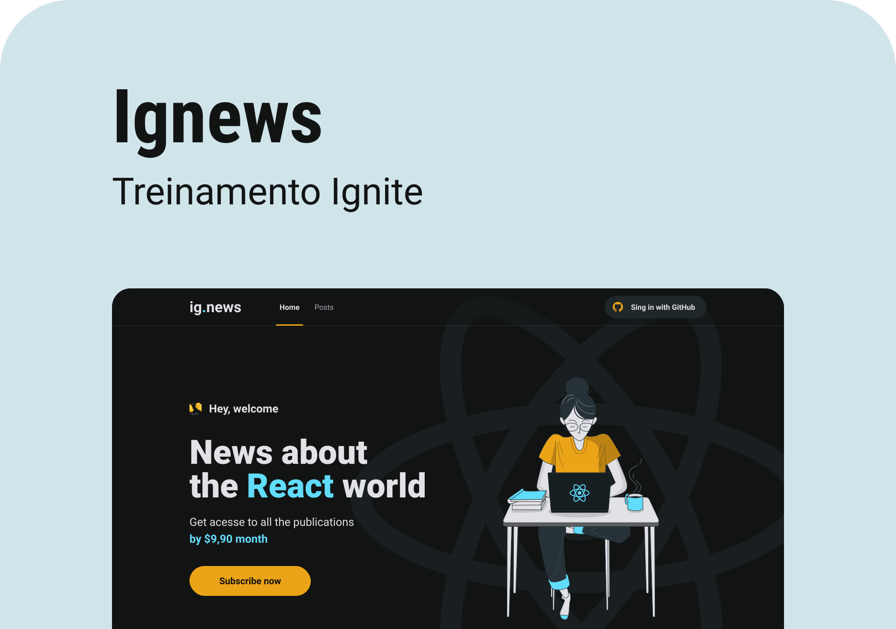

<h1 align="center">
    
</h1>

<br>


## 💻 Projeto

O Ignews é um projeto desenvolvido durante a formação Ignite na triha de React. A proposta do projeto se dá na criação de uma aplicação
de uma newsletter na qual os assinante conseguem criar uma assinatura e passam a consumir todo o conteúdo disponibilizado. 


<br>

## 🧪 Tecnologias

Esse projeto foi desenvolvido com as seguintes tecnologias:

- [React](https://reactjs.org)
- [TypeScript](https://www.typescriptlang.org/)
- [NextJs](https://nextjs.org/)
- [SASS](https://sass-lang.com/)
- [Stripe - Pagamentos ](https://stripe.com/br)
- [FaunaDB](https://fauna.com/)
- [Prismic - CMS](https://prismic.io/)


## 🚀 Como executar

Clone o projeto e acesse a pasta do mesmo.

```bash
$ git clone https://github.com/leandroaraujo5511/ignews.git
$ cd ignews
```

Para iniciá-lo, siga os passos abaixo:
```bash
# Instalar as dependências
$ yarn

# Iniciar o projeto
$ yarn start
```
O app estará disponível no seu browser pelo endereço http://localhost:3000.


## 🔖 Layout

Você pode visualizar o layout do projeto através do link abaixo:

- [Layout Web](https://www.figma.com/file/zK2kMlnLKOyPuyMe8jNJJL/ig.news-(Copy)?node-id=1%3A5) 

Lembrando que você precisa ter uma conta no [Figma](http://figma.com/).

